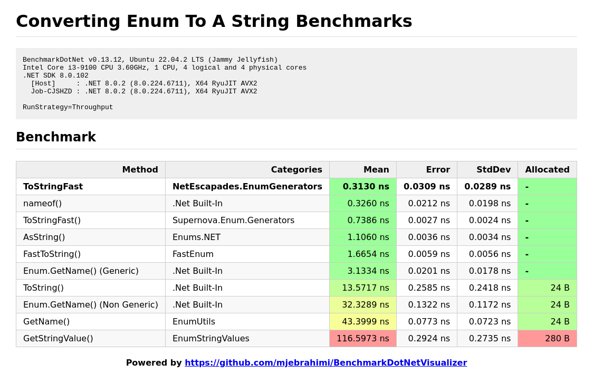


# Convert Enum To String Benchmark

## Key Results:

- Using `nameof()` is the **Fastest** way to convert enum to a string. As you see it takes 0.0 ns/op because it actually complies to a just literal string ([see the compiled code](https://sharplab.io/#v2:EYLgtghglgdgPgAQMwAIECYUGEUG8CwAUCiWqggIwAMKAsgBQCUeRpbaA7CjBGAKYB7AGb1aATwCiMAK5gAdAEEAMgJgBzBTAAmANT4AnYAIDOfKbIByvPowDcrUgF8HJF2RR8ZYOpK9uCxOwkyqoa2nqGJmZeVvxuzoSOQA))
- `nameof()` has the most efficient memory allocation beside `Enum.GetName()`(Generic overload).
- Using `Enum.GetName(Enum.GetName(typeof(MyEnum), MyEnum.ALongAndVerboseEnumName))` (Non-Generic overload) has the worst speed. (The main reason IMO is that it leads to boxing/unboxing)

