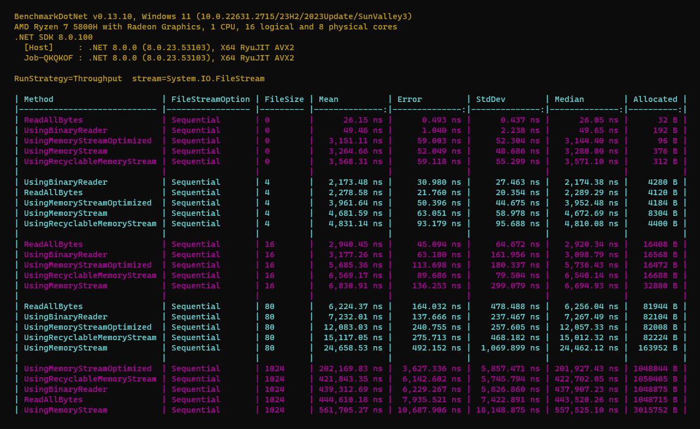

# Different ways to read byte[] from Stream

## Key Results

1. Both `ReadAllBytes` and `UsingBinaryReader` are **the best** and have **similar performance and allocation**
2. `ReadAllBytes` **does support Async** by `ReadAllBytesAsync` (but `UsingBinaryReader` **does NOT**)
3. Both `FileOptions.Sequential` and `FileOptions.None` for `FileStream` have **similar performance and are faster than** `FileOptions.Asynchronous`
4. Both `UsingMemoryStream` and `UsingRecyclableMemoryStream` usually have **similar performance** speed but the first one has **2x more allocation**
5. Using `UsingRecyclableMemoryStream` is better than `UsingMemoryStream` specially for **large** streams
6. `Sync` methods are **faster** than `Async` methods
7. `Async` methods with `FileOptions.None | Sequential` are **faster** than `FileOptions.Asynchronous`

**Sort by Performance (speed + allocation)**
1. ReadAllBytes - UsingBinaryReader[NoAsync]
2. UsingRecyclableMemoryStream
3. UsingMemoryStream

## Update

Using **MemoryStream** with the following performs **faster and more GC efficient**

- `capacity: stream.Length` instead of not specified capacity
- `bufferSize: stream.Length` instead of not specified bufferSize (default buffer size is 81920)
- `.GetBuffer()` instead of `.ToArray()`

**Interesting** that `UsingMemoryStreamOptimized` is **faster** (is this case 2x faster) than anything else in **large** streams

